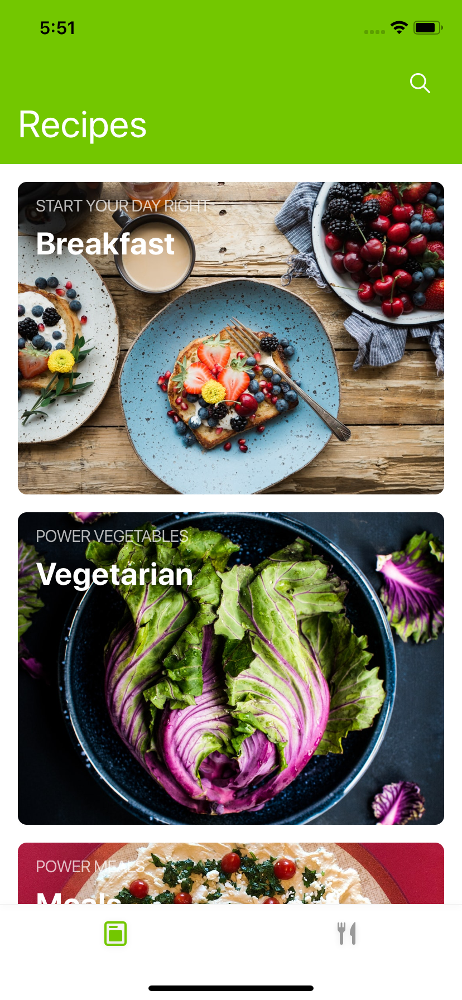
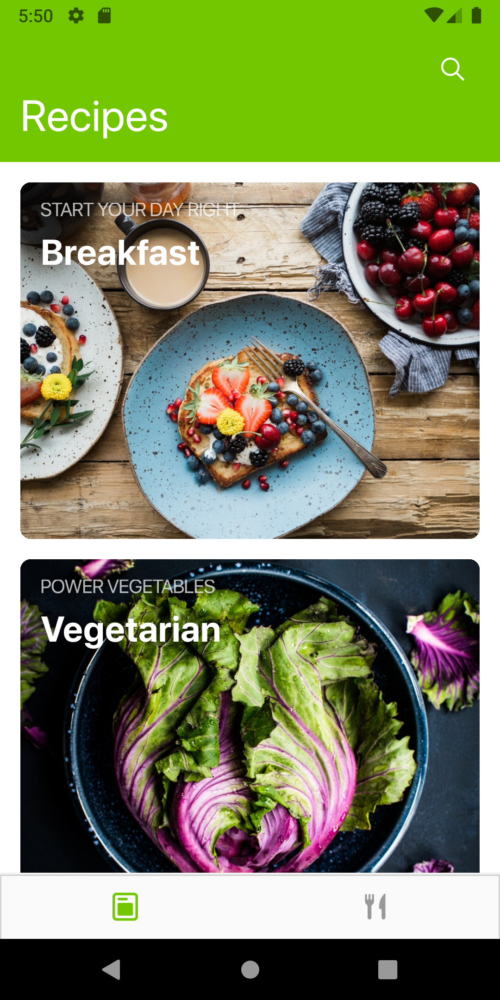

# Food App

A mock food app to practice React Native

### Usage

- Run `git clone https://github.com/rashtay/food-app.git` to clone the react native project.
- Rename `.env.local` to `.env`
- To install the project dependencies, run `yarn install`
- Run `npm run ios` to run the applicaion on the ios device. By default, it'll run on iPhone 11. You can change the default settings via `package.json`. You can find command in scripts.
- To install the app on android, run `npm run android`
- To run the server, `npm start`
- To reset the cache and run the server, `npm run reset-and-start`

### Caveats

- Fonts might not be similar though I tried to use an alternative which didn't seem similar. Even system fonts weren't similar.
- Tried to refrain from using `letterSpacing` at certain places because it didn't look good with the existing font.
- I have taken the liberty to use `react-native-vector-icons` for this project. If this is not something that you expected, then please do let me know. I'll replace it with the existing set.
- I am assuming that this task was supposed to test my UI building capabilities, I have built few components like search which aren't functional to save time so that I could wrap it up soon.
- I have taken certain liberties but it's just because I wanted to save time and this was a mock project.

### Issue Fixes

- App wasn't getting installed in Android. The issue occurred due to the package `react-native-screen`. It has been fixed https://github.com/kmagiera/react-native-screens/issues/166
- Android applies vertical padding to TextInput due to which style applied to TextInput for ios and android becomes inconsistent. https://github.com/facebook/react-native/issues/6096
- Added default status bar color

Please contact me if you have any queries. Thank you! :)

- +91 9096268273
- shettyrahul8june@gmail.com
